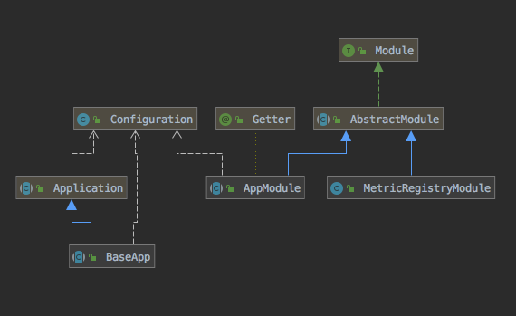
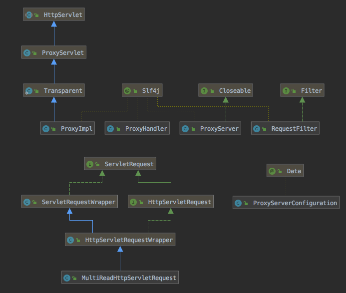
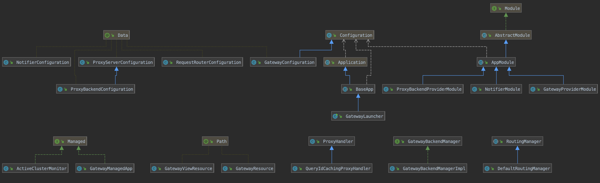

**Trino Gateway documentation**

<table>
  <tr>
    <td><b><a href="design.md">Design</a></b></td>
    <td><a href="development.md">Development</a></td>
    <td><a href="security.md">Security</a></td>
    <td><a href="operation.md">Operation</a></td>
    <td><a href="gateway-api.md">Gateway API</a></td>
    <td><a href="resource-groups-api.md">Resource groups API</a></td>
    <td><a href="routing-rules.md">Routing rules</a></td>
    <td><a href="references.md">References</a></td>
    <td><a href="release-notes.md">Release notes</a></td>
  </tr>
</table>

# Design

Trino Gateway has three main components:

1. BaseApp - It provides boilerplate code to add/remove pluggable components
   with config and metrics registration module.

2. ProxyServer - Its a library built on top of jetty proxy which provides a
   proxy server with a pluggable proxy-handler.

3. Gateway - This component acts as container for proxy-server and plugs in
   ProxyHandlers to provide proxy, routing and load balancing functionalities. It
   also exposes few end points and UI to activate, deactivate backends and view
   query history for recently submitted queries.

