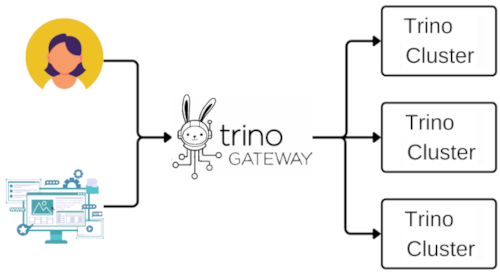

# Overview

Trino Gateway is a load balancer, proxy server, and configurable routing 
gateway for multiple [Trino](https://trino.io) clusters.

## Use cases, advantages, and features

* Use of a single connections URL for client tool users with workload
  distribution across multiple Trino clusters.
* Automatic routing of queries to dedicated Trino clusters for specific
  workloads or specific queries and data sources.
* No-downtime upgrades for Trino clusters behind the Trino Gateway in a
  blue/green model or canary deployment model.
* Transparent change of capacity of Trino clusters without user interruptions.

## High-level architecture

## Other resources

* [Trino Gateway announcement blog post](https://trino.io/blog/2023/09/28/trino-gateway)
* Many clusters and only one gateway:
    * Project announcement and overview at Trino Summit 2023 with use cases 
      from Bloomberg and Naver
    * :fontawesome-brands-youtube:{ .youtube } [Video recording](https://www.youtube.com/watch?v=2qwBcKmQSn0)
    * [Slide deck](./assets/misc/tgw-trino-summit-2023.pdf)
* [Slide deck about Trino Gateway status](./assets/misc/trino-gateway-status-at-tcc-202406.pdf)
  for Trino Contributor Congregation in June 2024
* [Lyft blog post](https://eng.lyft.com/trino-infrastructure-at-lyft-b10adb9db01)
* [Pinterest blog post](https://medium.com/pinterest-engineering/trino-at-pinterest-a8bda7515e52)
* [Zomato blog post](https://www.zomato.com/blog/powering-data-analytics-with-trino)
* [Shopify blog post](https://shopify.engineering/faster-trino-query-execution-infrastructure)
