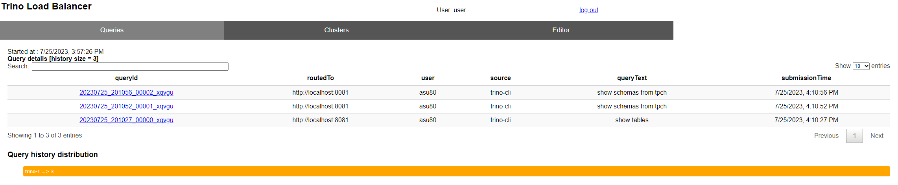
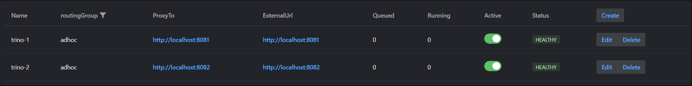

# Operation

The following aspects apply to managing Trino Gateway and the connected Trino
clusters.

## Query History UI - check query plans etc.

Trino Gateway records history of recent queries and displays links to check query
details page in respective trino cluster.


## Cluster UI - add and modify cluster information

The cluster page is used to configure Trino Gateway for multiple Trino clusters.
Existing cluster information can also be modified using the edit button.



**Note:** When adding or modifying a backend through the UI, a comment is required. Please provide a meaningful comment describing the reason for the change.

## Graceful shutdown

Trino Gateway supports graceful shutdown of Trino clusters. Even when a cluster
is deactivated, any submitted query states can still be retrieved based on the
Query ID.

To graceful shutdown a trino cluster without query losses, the steps are:

1. Deactivate the cluster by turning off the 'Active' switch. This ensures that no 
   new incoming queries are routed to the cluster.
2. Poll the Trino cluster coordinator URL until the queued query count and the
   running query count are both zero.
3. Terminate the Trino coordinator and worker Java processes.

To gracefully shutdown a single worker process, refer to the [Trino 
documentation](https://trino.io/docs/current/admin/graceful-shutdown.html) for
more details.

## Query routing options

- The default router selects the cluster randomly to route the queries. 
- If you want to route the queries to the least loaded cluster for a user
  so the cluster with the fewest running or queued queries,
use `QueryCountBasedRouter`. You can enable it by adding the module name 
to the `modules` section of the config file:

```yaml
modules:
  - io.trino.gateway.ha.module.QueryCountBasedRouterProvider
```
- The router operates based on the stats it receives from the clusters, such as 
the number of queued and running queries. These values are retrieved at regular 
intervals. This interval can be configured by setting `taskDelay` under
`monitor` section in the config file. The default interval is 1 minute
```yaml
monitor:
  taskDelay: 1m
```

## Monitoring <a name="monitoring"></a>

Trino Gateway provides a metrics endpoint that uses the OpenMetrics format at 
`/metrics`. Use it to monitor Trino Gateway instances with Prometheus and 
other compatible systems with the following Prometheus configuration:

```yaml
scrape_configs:
- job_name: trino_gateway
  static_configs:
    - targets:
        - gateway1.example.com:8080
```

## Trino Gateway health endpoints

Trino Gateway provides two API endpoints to indicate the current status of the server:

* `/trino-gateway/livez` always returns status code 200, indicating the server is
alive. However, it might not respond if the Trino Gateway is too busy, stuck, or
taking a long time for garbage collection.
* `/trino-gateway/readyz` returns status code 200, indicating the server has
completed initialization and is ready to serve requests. This means the initial
connection to the database and the first round of health check on Trino clusters
are completed. Otherwise, status code 503 is returned.

## Audit logging
Trino Gateway provides the AuditLogger interface for recording admin backend update events 
to different pluggable outputs/sinks. Currently, there's implementations for logs.info and to 
a database table.
