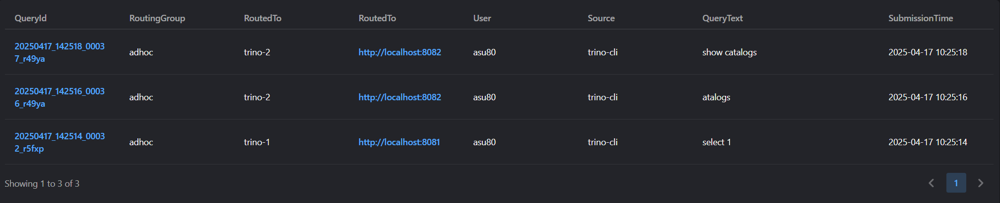
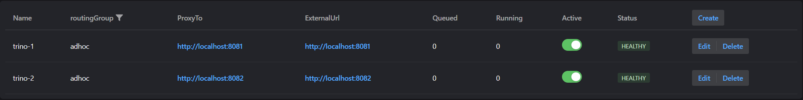

# Operation

The following aspects apply to managing Trino Gateway and the connected Trino
clusters.

## Query History UI - check query plans etc.

Trino Gateway records history of recent queries and displays links to check query
details page in respective trino cluster.


## Cluster UI - add and modify cluster information

The cluster page is used to configure Trino Gateway for multiple Trino clusters.
Existing cluster information can also be modified using the edit button.




## Cluster configuration and health status

Trino Gateway tracks cluster state at two separate layers, each serving a
different purpose.

### Database: source of truth for configuration

All cluster configuration is stored persistently in a database. This includes
each cluster's name, routing group, proxy URL, external URL, and whether it is
marked active or inactive.

Any change made through the API or the admin UI — adding, updating, activating,
deactivating, or deleting a cluster — is written to the database immediately.
The database represents **what you have configured**: the intended state of the
system. It persists across restarts.

### Health check cache: source of truth for routing

In addition to the database, Trino Gateway maintains an in-memory record of
each cluster's current health. This cache is separate from the database and is
used to make all query routing decisions.

Each cluster in the cache has one of four health statuses:

| Status | Meaning |
|--------|---------|
| `HEALTHY` | The cluster is reachable and accepting queries |
| `UNHEALTHY` | The cluster failed its most recent health check |
| `PENDING` | The cluster was recently added or changed and has not yet been health-checked |
| `UNKNOWN` | Health status could not be determined |

Only clusters with a `HEALTHY` status receive query traffic, regardless of
whether the database marks them as active.

The cache is updated by a background health check that runs at a configurable
interval (default: every 1 minute, set via `monitor.taskDelay`). The health
check mechanism itself is also configurable — by default it calls the `/v1/info`
endpoint on each cluster, but JDBC, JMX, and Prometheus metrics are also
supported.

### How the two layers interact

The database and health cache serve complementary roles:

- **Database** — "what you configured"
- **Health cache** — "what is actually reachable right now"

When you make a change via the API or admin UI, both layers are updated
immediately:

| Action | Database | Health cache |
|--------|----------|-------------|
| Add a cluster | Written immediately | Set to `PENDING`; transitions to `HEALTHY` after the first successful health check |
| Update a cluster | Written immediately | Reset to `PENDING` |
| Activate a cluster | Written immediately | Set to `PENDING` |
| Deactivate a cluster | Written immediately | Set to `UNHEALTHY`; excluded from routing immediately |
| Delete a cluster | Removed immediately | Set to `UNHEALTHY`; excluded from routing immediately |

A cluster that crashes or becomes unreachable after the last health check will
remain active in the database but will be marked `UNHEALTHY` in the cache
within one polling interval. During that window, in-flight queries already
routed to that cluster may fail, but no new queries will be sent to it once the
cache is updated.

The health cache is not persisted — it is rebuilt from the database and
repopulated by health checks each time Trino Gateway starts.

## Graceful shutdown

Trino Gateway supports graceful shutdown of Trino clusters. Even when a cluster
is deactivated, any submitted query states can still be retrieved based on the
Query ID.

To graceful shutdown a Trino cluster without query losses, the steps are:

1. Deactivate the cluster by turning off the 'Active' switch. This ensures that no
   new incoming queries are routed to the cluster.
2. Poll the Trino cluster coordinator URL until the queued query count and the
   running query count are both zero.
3. Terminate the Trino coordinator and worker Java processes.

To gracefully shutdown a single worker process, refer to the [Trino 
documentation](https://trino.io/docs/current/admin/graceful-shutdown.html) for
more details.

## Query routing options

- The default router selects the cluster randomly to route the queries.
- If you want to route the queries to the least loaded cluster for a user,
  i.e. the cluster with the fewest running or queued queries,
  use `QueryCountBasedRouter`. You can enable it by adding the module name
  to the `modules` section of the config file:

```yaml
modules:
  - io.trino.gateway.ha.module.QueryCountBasedRouterProvider
```
- The router operates based on the stats it receives from the clusters, such as
  the number of queued and running queries. These values are retrieved at regular
  intervals. This interval can be configured by setting `taskDelay` under the
  `monitor` section in the config file. The default interval is 1 minute:
```yaml
monitor:
  taskDelay: 1m
```

## Monitoring <a name="monitoring"></a>

Trino Gateway provides a metrics endpoint that uses the OpenMetrics format at 
`/metrics`. Use it to monitor Trino Gateway instances with Prometheus and 
other compatible systems with the following Prometheus configuration:

```yaml
scrape_configs:
- job_name: trino_gateway
  static_configs:
    - targets:
        - gateway1.example.com:8080
```

## Trino Gateway health endpoints

Trino Gateway provides two API endpoints to indicate the current status of the server:

* `/trino-gateway/livez` always returns status code 200, indicating the server is
alive. However, it might not respond if the Trino Gateway is too busy, stuck, or
taking a long time for garbage collection.
* `/trino-gateway/readyz` returns status code 200, indicating the server has
completed initialization and is ready to serve requests. This means the initial
connection to the database and the first round of health check on Trino clusters
are completed. Otherwise, status code 503 is returned.

## Database cache configuration

Trino Gateway can cache database queries to improve performance and reduce load
on the backend database. This also allow gateway to continue routing queries
when the database is temporarily unavailable. Currently only the list of backend
Trino clusters used for query routing are being cached.
The cache can be configured using the `databaseCache` section in the config file.

```yaml
databaseCache:
  enabled: true
  expireAfterWrite: 1h
  refreshAfterWrite: 5s
```

Configuration options:

* `enabled` - Enable or disable the database cache. Default is `false`.
* `expireAfterWrite` - The maximum time a cached entry is kept since it was last
  loaded or refreshed. This ensures stale data is eventually removed.
  If cache is not refreshed before expiration, requests will fail once the entry
  expires (i.e. cache miss will attempt to reload data, but if the database is unavailable,
  the request fails because there is no stale value to fall back to after
  expiration). Default value is `1h`.
* `refreshAfterWrite` - Duration after which cache entries are eligible for
  asynchronous refresh. When a refresh is triggered, the existing cached value
  continues to be served while the refresh happens in the background.
  This helps keep data fresh while serving slightly stale data to avoid blocking requests.
  Default value is `5s`.

`expireAfterWrite` and `refreshAfterWrite` can be set to `null` to disable expiration
or refresh respectively.
