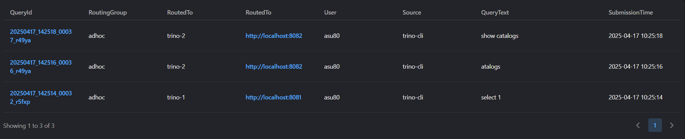

# Operation

The following aspects apply to managing Trino Gateway and the connected Trino
clusters.

## Query History UI - check query plans etc.

Trino Gateway records history of recent queries and displays links to check query
details page in respective trino cluster.


## Admin UI - add and modify backend information

The admin page is used to configure the gateway to multiple backends.
Existing backend information can also be modified using the same.


## Graceful shutdown

Trino Gateway supports graceful shutdown of Trino clusters. Even when a cluster
is deactivated, any submitted query states can still be retrieved based on the
Query ID.

To graceful shutdown a trino cluster without query losses, the steps are:

1. Set the backend to deactivate state, this prevents any new incoming queries
   from getting assigned to the backend.
2. Poll the trino backend coorinator URL until the queued query count and the
   running query count both hit 0.
3. Terminate the trino Coordinator & Worker Java process.

To gracefully shutdown a single worker process, refer to the [Trino 
documentation](https://trino.io/docs/current/admin/graceful-shutdown.html) for
more details.

## Query routing options

- The default router selects the backend randomly to route the queries. 
- If you want to route the queries to the least loaded backend for a user
i.e. backend with the least number of queries running or queued from a particular user,
then use `QueryCountBasedRouter`, it can be configured by adding the module name 
to config file's modules section like below

```yaml
modules:
  - io.trino.gateway.ha.module.QueryCountBasedRouterProvider
```
- The router works on the stats it receives from the clusters about the load i.e number queries queued and running on a cluster at regular intervals which can be configured like below. The default interval is 1 min
```yaml
monitor:
  taskDelaySeconds: 10
```

## Monitoring <a name="monitoring"></a>

Trino Gateway provides a metrics endpoint that uses the OpenMetrics format at 
`/metrics`. Use it to monitor Trino Gateway instances with Prometheus and 
other compatible systems with the following Prometheus configuration:

```yaml
scrape_configs:
- job_name: trino_gateway
  static_configs:
    - targets:
        - gateway1.example.com:8080
```

## Trino Gateway health endpoints

Trino Gateway provides two API endpoints to indicate the current status of the server:

* `/trino-gateway/livez` always returns status code 200, indicating the server is
alive. However, it might not respond if the Trino Gateway is too busy, stuck, or
taking a long time for garbage collection.
* `/trino-gateway/readyz` returns status code 200, indicating the server has
completed initialization and is ready to serve requests. This means the initial
connection to the database and the first round of health check on Trino clusters
are completed. Otherwise, status code 503 is returned.
