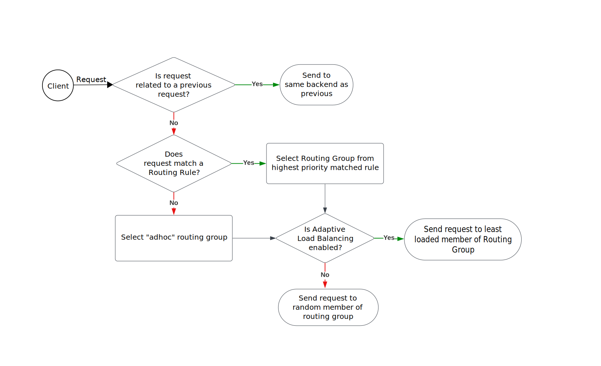

# Routing Logic

## Overview

Trino Gateway checks incoming requests to see if they're related to previous 
ones it handled. If they are, then Trino Gateway sends them to the same 
Trino cluster that dealt with the earlier requests.

If it is a new request, the Trino Gateway refers to [Routing rules](routing-rules.md) 
to decide which group of clusters, called a 'Routing Group,' should handle it. 
It then picks a cluster from that Routing Group to handle the request using 
either an adaptive or round-robin strategy.



## Sticky routing

A request related to an ongoing process, or to state maintained on a single 
Trino cluster, must be routed to that cluster for proper handling. Two 
mechanisms for identifying related requests are currently implemented. By default,
only routing based on query identifier is enabled.

### Routing based on query identifier (default)

When a query is initiated through the Trino Gateway, the query id will be 
extracted from the response and mapped to the cluster that provided the 
response. Any subsequent request containing that query id will be forwarded 
to that cluster. For example, to retrieve query results, the Trino client 
polls a URI of the form 
`v1/statement/executing/queryid/nonce/counter`. The Trino Gateway will extract
the queryid from this URI.

### Routing based on cookies

OAuth2 authentication requires that the same cluster is used for each step of 
the handshake. When `gatewayCookieConfiguration.enabled` is set to true, a cookie 
will be added to requests made to paths beginning with `/oauth2` unless they already have 
a cookie present, which is used to route further `/oauth2/*` requests to the correct cluster. 
Cookies are not added to requests to `v1/*` and other Trino endpoints.

Trino Gateway signs its cookies to ensure that they are not tampered with. You 
must set a `cookieSigningSecret` string in your configuration
```yaml
gatewayCookieConfiguration:
    enabled: true
    cookieSigningSecret: "ahighentropystring"
```
when making use of this feature. If you load balance request across multiple Trino Gateway
instances, ensure each instance has the same `cookieSigningSecret`.

The Trino Gateway handles standard Trino OAuth2 handshakes with no additional 
configuration. If you are using a customized or commercial Trino distribution, then
the paths used to define the OAuth handshake may be modified.

`routingPaths`: If the request URI starts with a path in this list, then
* If no cookie is present, add a routing cookie
* If a cookie is present, route the request to the cluster defined by that cookie

`deletePaths`: If the request URI starts with a path in this list,
return a response that instructs the client to delete the cookie.

Additionally, the `lifetime` property sets the duration for which a cookie remains in 
effect after creation. Ensure that it is greater than
the time required to complete the handshake. Default `lifetime` is 10 minutes.

These properties are defined under the `oauth2GatewayCookieConfiguration` node: 

```yaml
oauth2GatewayCookieConfiguration:
  routingPaths:
    - "/oauth2"
    - "/custom/oauth2/callback"
    - "/alternative/oauth2/initiate"
  deletePaths:
    - "/custom/logout"
  lifetime: "5m"
```

## Routing URLs

Each Trino cluster configured with the Trino Gateway includes both a `proxyTo` 
URL and an `externalURL`. The `proxyTo` URL is used internally by the Trino 
Gateway to route requests based on routing rules and query identifiers, whereas 
the `externalURL` serves as a UI-accessible or publicly reachable address for 
the Trino cluster, and is commonly used to access [Trino web UI](https://trino.io/docs/current/admin/web-interface.html)  

For example, in a Kubernetes environment, the `proxyTo` URL might be 
`trino-backend-service.trino-namespace.svc.cluster.local:8083` for communication 
between the Trino Gateway and Trino clusters, and the external URL for the same 
backend cluster might be `trino.domain.com`.
