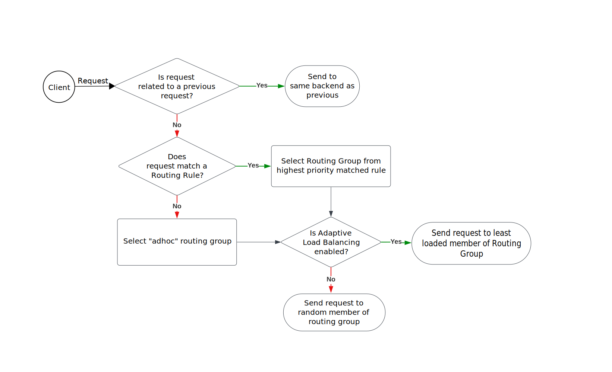

**Trino Gateway documentation**

<table>
  <tr>
    <td>
      
    </td>
    <td>
      <ul>
        <li><a href="quickstart.md">Quickstart</a></li>
        <li><a href="installation.md">Installation</a></li>
        <li><a href="security.md">Security</a></li>
        <li><a href="operation.md">Operation</a></li>
      </ul>
    </td>
    <td>
      <ul>
        <li><a href="gateway-api.md">Gateway API</a></li>
        <li><a href="resource-groups-api.md">Resource groups API</a></li>
        <li><a href="routing-rules.md">Routing rules</a></li>
        <li><a href="routing-logic.md">Routing logic</a></li>
      </ul>
    </td>
    <td>
      <ul>
        <li><a href="design.md">Design</a></li>
        <li><a href="development.md">Development</a></li>
        <li><a href="release-notes.md">Release notes</a></li>
        <li><a href="references.md">References</a></li>
      </ul>
    </td>
  </tr>
</table>

# Routing Logic

## Overview

Incoming requests are evaluated by the Trino Gateway to determine if they
are a follow-up to a request previously handled by the Trino Gateway. If the 
Trino Gateway determines that they are, they are forwarded to whatever the 
backend that handled the previous request.

If the request is new, Trino Gateway first uses [Routing rules](routing-rules.md)
to determine which logical group of clusters, termed a "Routing Group",
should handle the request. A member of the Routing Group, termed a backend, 
is selected to handle the request using either an adaptive or round-robin 
strategy.



## Sticky routing

A request related to an ongoing process or state maintained on a single 
backend cluster must be routed to that backend for proper handling. Two 
mechanisms for identifying related requests are currently implemented. By default,
only Query ID based routing is enabled.

### Query ID Based Routing

When a query is initiated through the Trino Gateway, the query id will be 
extracted from the response and mapped to the backend that provided the 
response. Any subsequent request containing that query id will be forwarded 
to that backend. For example, to retrieve query results, the trino client 
polls a URI of the form 
`v1/statement/executing/queryid/nonce/counter`. The Trino Gateway will extract
the queryid from this URI.

### Cookie Based Routing

The Trino Gateway can add a session cookie to identify related requests. This is 
useful for exchanges such as the OAuth handshake, where it isn't possible 
to determine which backend handled the previous request based solely on
the request URI and body.

#### Cookie Based Routing Configuration

`cookiePaths`: If the request URI starts with a path in this list, add a 
session cookie if none exists. If a cookie exists, route the request to
the backend associated with that cookie.

`removeCookiePaths`: If the request URI starts with a path in this list,
return a response that instructs the client to delete the cookie.

#### Cookie Based Routing for OAuth2

The default OAuth2 handshake for the Trino REST API has the following steps 
1. The client requests https://trino/v1/endpoint. The response includes
```
HTTP/2 401
www-authenticate: Bearer x_redirect_server="https://trino/oauth2/token/initiate
, x_token_server="https://trino/oauth2/token/encoded_token"
```
which prompts the client to use oauth2 authentication.
2. GET https://trino/oauth2/token/encoded_token. The response redirects to the IdP's auth endpoint.
3. GET https://idp/auth_endpoint. The response includes an authorization code and 
redirects the client back to the coordinator's callback endpoint.
4. GET https://trino/oauth2/callback?authroization_code_parameters. The coordinator 
sends the authorization code to the IdP in combination with secrets generated in 
step (1). The IdP returns an access token to the coordinator, which encodes it and sends
it to the client.

Adding the configuration
```yaml
cookiePaths: /oauth2
```
will cause the Trino Gateway to include a session cookie in the response to the
request to `/oauth2/token` endpoint. This session cookie will be carried through the client's request
to the IdP auth endpoint and `/oauth2/callback`. The session cookie ensures that the request
to `/oauth2/callback` is made to the backend cluster that initiated the exchange, which
is the only backend which has the secrets that allow it to use the authorization code. 

The handshake for the Web UI is slightly different, but because it still uses endpoints
under `/oauth2`, the same configuration supports a Web UI secured with OAuth2. Adding
```yaml
deleteCookiePaths: /ui/logout
```
will force removal of the session cookie when a user logs out.

This configuration will not affect requests to any `v1/*` or other Trino endpoints, so
queries and other requests will still be routed according to Routing Rules.
